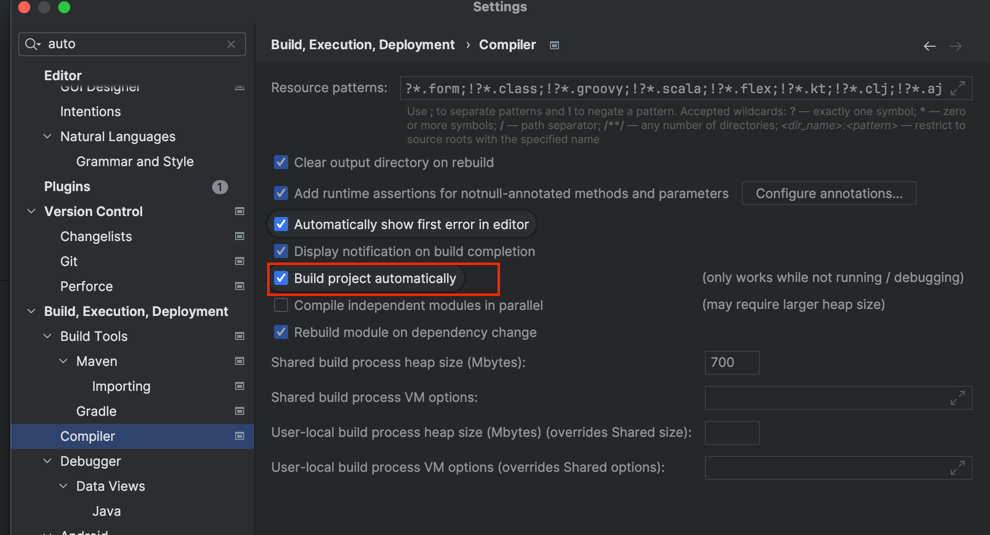
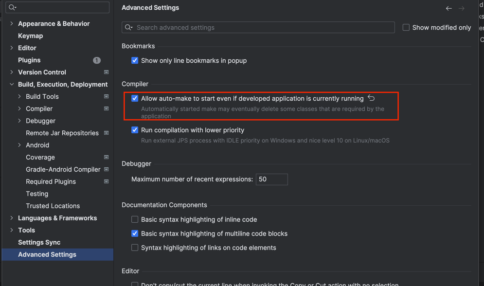

# AlgoSolved

## 백엔드 실행 방법
```
# backend 폴더에서 .env 파일을 생성하고 필요한 내용을 기입합니다
cp .env.sample .env

# 최상위 경로에서 docker compose 를 실행합니다
docker-compose up -d --build
```

## 백엔드 서버 자동 빌드 설정 방법
1. 인텔리제이에서 auto build 를 설정합니다.

2. 코드 변경 시 spring 이 재시작하도록 설정합니다.


## 프론트 실행 방법
```
# frontend 폴더에서 환경에 맞게 로컬 빌드
npm run start:dev

# 최상위 경로에서 docker compose 를 실행합니다. 로컬에서 변경하면 자동으로 docker에 적용됩니다.
docker-compose up -d --build
```

## DB 데이터 생성방법
DB 데이터 덤프파일은 backend/db_dump_files 에 sql 포맷으로 있습니다. 이를 실행하면 기존 데이터가 삭제되고 새로운 데이터가 생성됩니다.
```bash
# backend 폴더에서 아래 명령어를 실행합니다
./scripts/db_restore.sh
```

## DB 데이터 백업방법
```bash
# backend 폴더에서 아래 명령어를 실행합니다
./scripts/db_dump.sh
```

## TODO
- DB 백업 파일위치를 S3 로 옮길것

## 포맷팅
```
java -jar google-java-format.jar --aosp --replace **/*.java
```

## 테스트
```
./gradlew test
```

